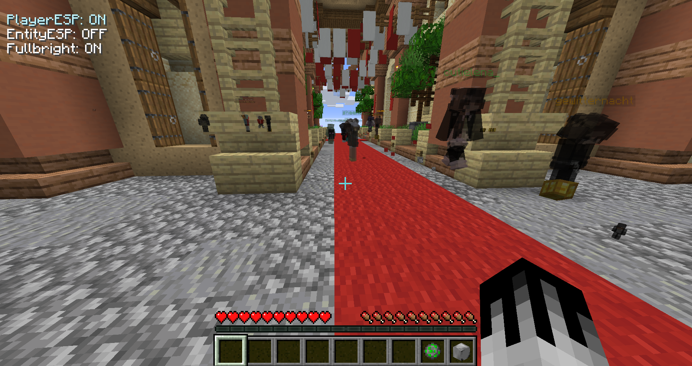

<link rel="stylesheet" href="style.css">

   <h3>Active project: MC-Exploit v1.16.5</h3>
   The MC-Exploit is a Minecraft java edition exploit for 1.16.5 
   You can find the project page <a class="a" href="client">here</a> and the github page <a class="a" href="https://github.com/ZeroZipp/Vetex-Client/">here</a> 
   <button class="button" onclick="size('client')">Project page</button>

